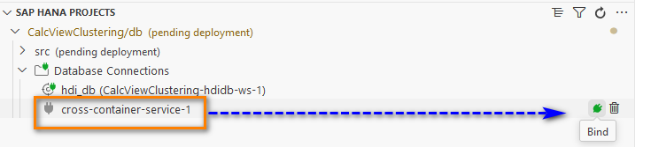
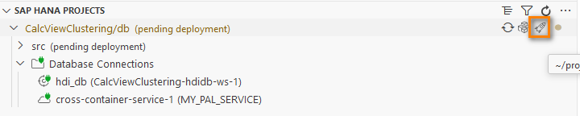
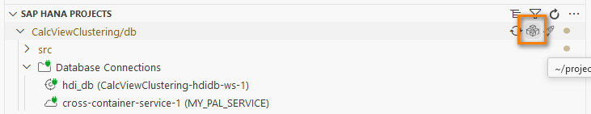
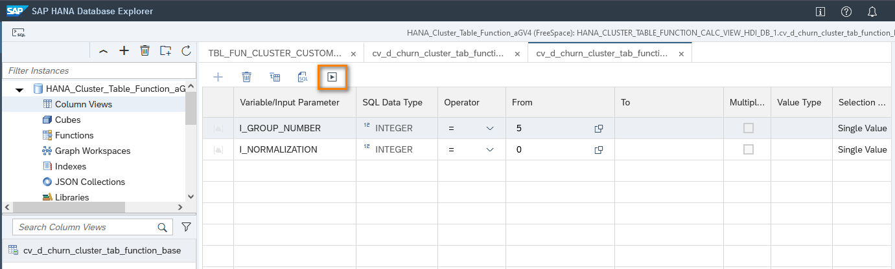

# About this Github Repository

This Github repository contains a SAP HANA database project that illustrates the usage of machine learning logic in Calculation Views. The project can be imported in SAP Business Application Studio. The project contains a table function that implements the K-Means Cluster procedure from PAL (Predictive Analysis Library) and a Calculation View that calls the table functions. This Calculation View can be integrated into stacked Calculation Views allowing to analyze and visualize the resulting cluster analysis.
As this project uses the HDI (HANA deployment infrastructure) some preparation for access of the procedures from PAL is required.

## Prerequisites
This project was developed using Business Application Studio (BAS).
It can be deployed to SAP HANA Cloud. Since BAS supports deployment to XSA also, it should be *in principal* possible to deploy it to an on-premise system. I am happy to hear from you if you experiment with deploying to on-premise systems.

*Note*: The machine learning services of SAP HANA (PAL) are available on SAP BTP free tier or a productive account. There are *not* available in SAP BTP trial account.

In your SAP BTP account you need the following services:

- SAP HANA Cloud instance (and corresponding services)
- SAP HANA Schemas & HDI Containers
- Cloud Foundry
- Business Application Studio

The following tutorials and links on SAP developers are a good starting point for setting up your SAP HANA Cloud instance:


## Import project to Business Application Studio
Open BAS. On the tab "Simplified Git", click on "Clone Repository" and enter the url of this GitHub repository: https://github.com/drabap/CalcViewClustering.


You are asked, if you want to add the repository to your current workspace. Click on "Add to current workspace" or "Open" and return to the Project explorer.

The project should look like this:


Before deploying the project you have to add two services to the project

- An HDI container as a deployment target
- A user-provided service "MY_PAL_SERVICE" for accessing the PAL procedures of SAP HANA's AFL.

First let us look at creating the HDI container as deployment target.
## Create HDI target container for deployment

Click on "Add service" and select "Create HDI container":

Note: When creating a SAP HANA project from scratch such an HDI container is automatically created during first deployment.

Before deploying this project, you need to add the user provided service as it is described in the next section.

## Preparation - Providing a user provided service
In order to access the machine learning procedures of PAL inside SQLScript design-time objects like table functions, you have to provide an *external services* with sufficient permissions for the execution of PAL procedure.
First, you create a technical user (see below) and then you add an external services based on this technical user to the HDI container (see below). 


### Create technical user
First create a technical user called ``MY_PAL_USER_CC``. 
Open a SQL console with user DBADMIN and execute the following statement replacing *\<PASSWORD\>* with a password of your choice:

```sql
CREATE USER MY_PAL_USER_CC PASSWORD <PASSWORD> NO FORCE_FIRST_PASSWORD_CHANGE;
ALTER USER MY_PAL_USER_CC DISABLE PASSWORD LIFETIME;
```

(Statement adapted from the blog: https://community.sap.com/t5/artificial-intelligence-and-machine-learning-blogs/hands-on-tutorial-machine-learning-with-sap-hana-cloud/ba-p/13683430).

Next grant AFL__SYS_AFL_AFLPAL_EXECUTE to the technical user with admin option:

```sql
GRANT afl__sys_afl_aflpal_execute to MY_PAL_USER_CC WITH ADMIN OPTION
```
Note: During deployment the user MY_PAL_USER_CC will grant this role to the object owner of the HDI container. Thats why you need the *ADMIN OPTION* here.

### Add user provided service
In BAS go to tab "SAP HANA Projects" -> Database Connections and select "Add":



Select "Creater user-provided service instance". As Service name enter 'MY_PAL_SERVICE'.
In the field "Enter user name" enter the name of the technical database user that you just created:


Dont check the box "Generate hdbgrants file" as the GitHub projects supplies already the hdbgrant file "MY_PAL_SERVICE.hdbgrants" that defines which permissions are granted via service MY_PAL_SERVICE.


## Deployment and experimenting with calculation views
Now you can deploy the SAP HANA project.



Execute the table function from SQL console:

In the tab "SAP HANA Projects" click on "Open Database Container" next to your project:



Open an SQL Console in the HDI container and paste the following code:

```sql
DO
BEGIN

lt_churn = SELECT CUSTOMERID,
	 CREDITSCORE,
	 GEOGRAPHY,
	 GENDER,
	 AGE,
	 TENURE,
	 BALANCE,
	 NUMOFPRODUCTS,
	 HASCRCARD,
	 ISACTIVEMEMBER,
	 ESTIMATEDSALARY
FROM "CHURN";

SELECT * FROM "TBL_FUN_CLUSTER_CUSTOMER_TAB_INPUT"(IT_DATA => :lt_churn);

END;

```
Result:


Open Calculation View base: 
Under the register 'Column Views' open view *cv_d_churn_cluster_tab_function_base* and click "Open Data":
You are prompted to supply input parameters *I_GROUP_NUMBER* and *I_NORMALIZATION*. Keep the default values and click on "Open content":



The cluster logic is executed and the result is shown:


## Additional information

Supplied are some additional information.

### Understanding the hdbgrant file

Note: The file MY_PAL_SERVICE.hdbgrants controls which roles/privileges are granted to the object owner by the technical user MY_PAL_USER_CC during deployment. In the tab "object owner" you can see the role 'AFL_SYS_AFL_AFLPAL_EXECUTE':

You can open the hdbgrant file also with an text-editor:


### Usage of PAL procedures using synonyms


